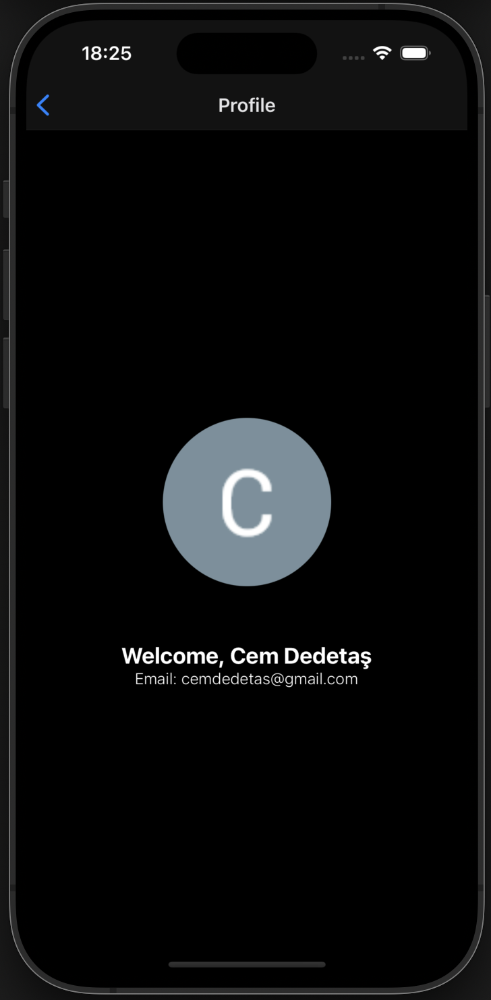
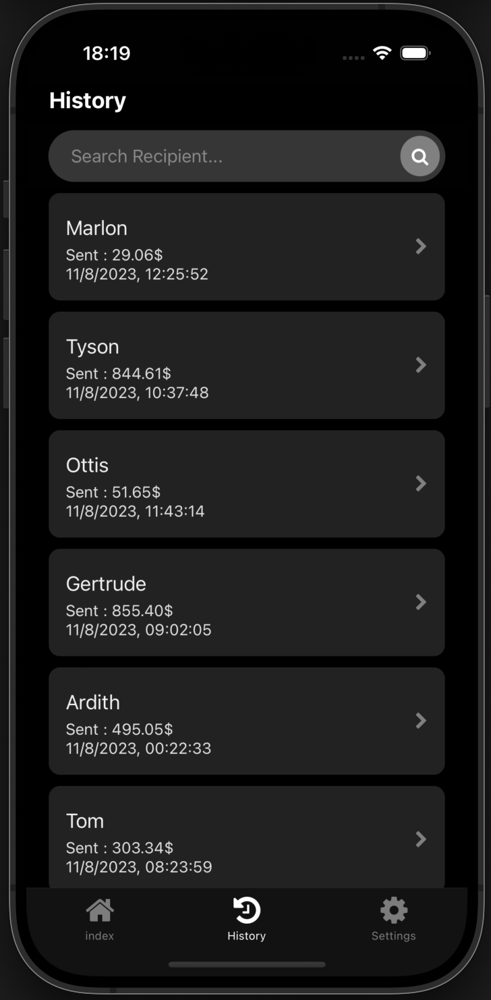
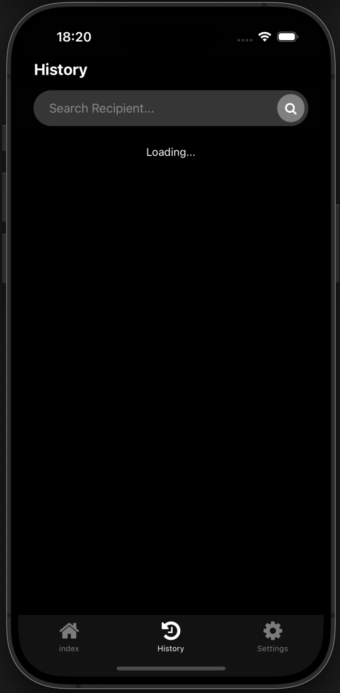
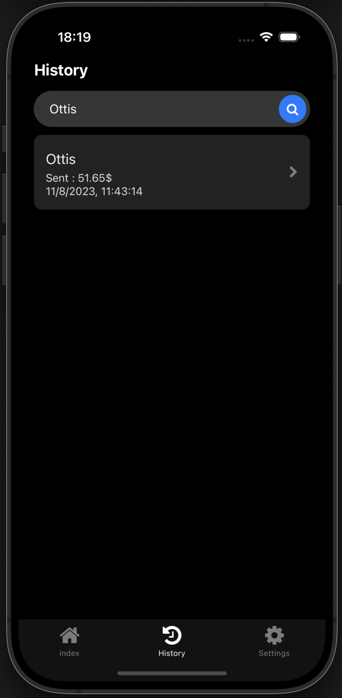
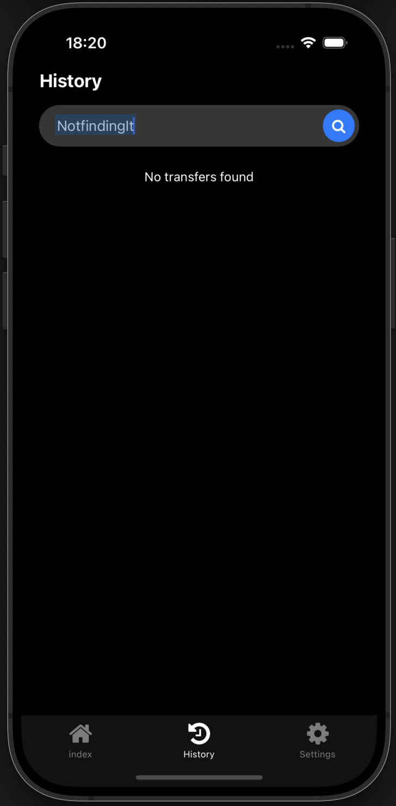
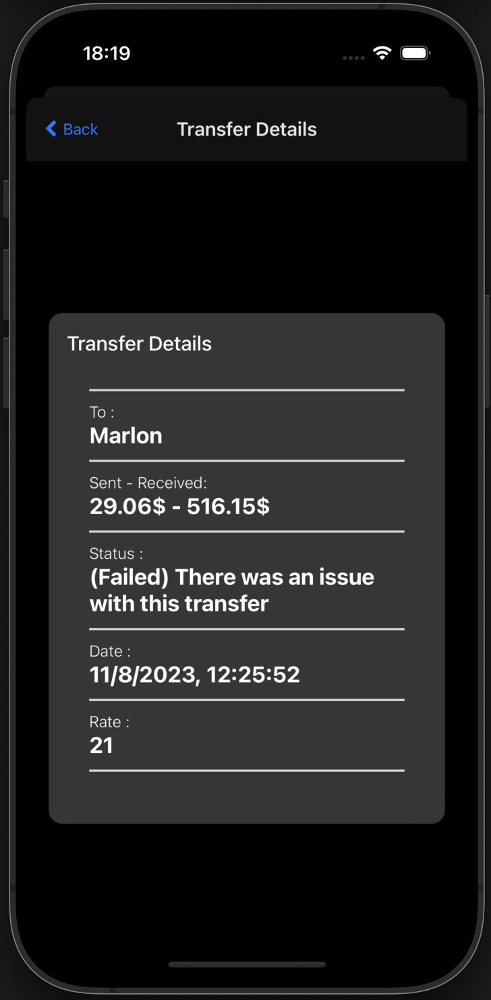

# ScopeXCaseStudy

## Table of Contents

1. [Introduction](#introduction)
2. [Authentication Flow](#authentication)
3. [Getting Started](#getting-started)
    - [Tech Stack ](#tech-stack)
    - [Prerequisites](#prerequisites)
    - [Installation](#installation)
5. [Usage](#usage)
6. [Screenshots](#screenshots)
    - [Home](#home)
    - [Profile](#profile)
    - [Create Job](#create-job)
    - [Job Details](#job-details)
    - [Job List](#job-list)
    - [Chat](#chat)

## Introduction

This is a case study for ScopeX. It is a mobile application that allows users to transfer money to other users. It is built with React Native and Expo.


## Getting Started


### Tech Stack 
- Expo 49
- React Native
- Typescript
- Google Auth

### Authentication

The authentication is done with Google Auth. The user is redirected to a google login page and after the user logs in, the user is redirected back to the application. The user's email and name is stored in the expo-secure-store. The user is redirected to the home page if the user is already logged in.

This is achieved with the help of custom auth provider that wraps around the entire application and auth hooks. The auth provider is a context provider that checks the user's information and allows the NAvigation stack to move on to the protected views and the auth hooks are custom hooks that are used to access the user's information.

### Prerequisites
- npm (more spesifically npx)
- a simulator or a physical device to run

### Installation
```bash
yarn install
```
## Usage
!Do not run on expo go, google auth needs a standalone application or a development build to redirect.

For iOS:
```bash
npx expo run:ios
```

For Android:
```bash
npx expo run:android
```

## Screenshots

### Home
 | 
--- | ---
### Auth
 | 
--- | ---
### Profile
 | 
--- | ---
### Transfers
 | 
--- | ---
 | 
 | 
 | 

### Detail View
 | 
--- | ---

